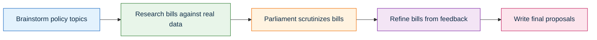
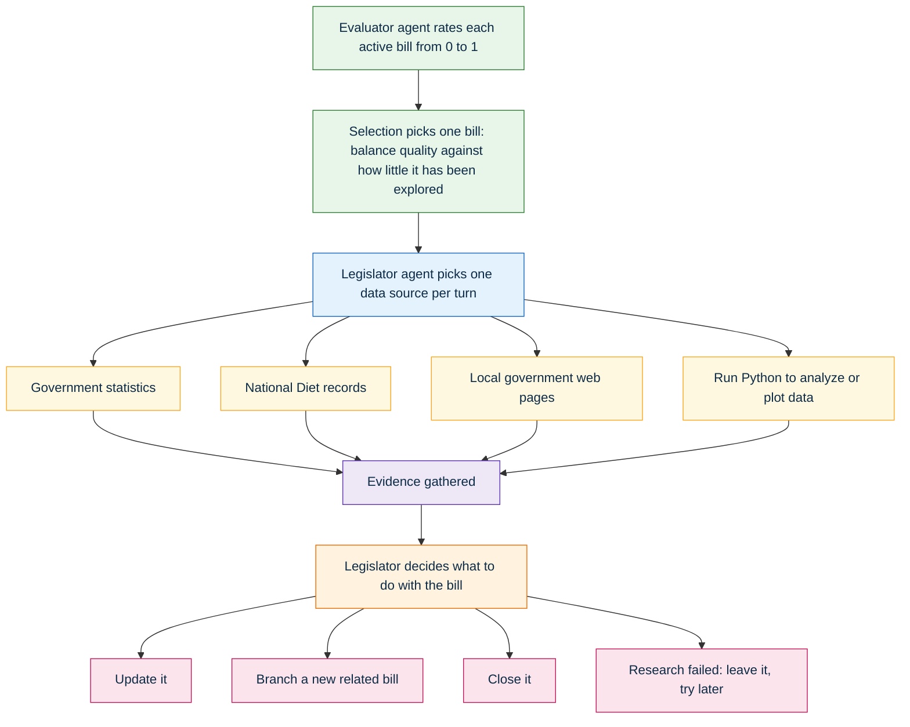

# AI Legislator (AI議員)

**AI Legislator** is a single-pass LLM-agent pipeline that drafts municipal bills (議案) grounded in real Japanese government data. Inspired by Sakana AI's *The AI Scientist*, it swaps the science-paper loop for a legislative one: it brainstorms policy topics for a target jurisdiction, researches supporting and opposing evidence from official sources, drafts bills, scrutinizes them in a simulated parliamentary Q&A (質疑応答), refines them from that feedback, and writes up final proposals.

Two ideas drive the system. A separate **Evaluator agent** scores every active bill on concrete criteria (is it grounded in evidence? specific? a fit for this level of government? feasible?), and a **bandit selection policy (UCB)** uses those scores to decide which bills earn more research effort — balancing a bill's quality against how little it has been explored so far.

---

## How it works

### Pipeline (stage flow)

The run is a single forward pass through five stages.



1. **Brainstorm** — generate policy topics for the jurisdiction, and spawn several candidate bills per topic, each grounded by an initial research pass.
2. **Research** — repeatedly select a bill and gather evidence for it, updating, branching, or closing it based on what is found.
3. **Parliament** — take the most promising bills, render each to a PDF, and run several rounds of sharp questions and evidence-based answers.
4. **Refinement** — re-research the bills to address the specific weaknesses parliament exposed.
5. **Write-up** — produce the final, submission-ready proposals (and, where evidence is still thin, a data-collection / verification plan).

### Inside one research step

Each research step combines the selection policy, the Evaluator, the inner tool-use loop, and the legislator's decision about what to do with the bill afterward.



The selection score for a bill is its Evaluator quality `Q` plus an exploration bonus that shrinks the more a bill has already been researched:

```
score = Q + c · sqrt( ln(rounds the bill has existed) / (times it has been researched) )
```

Scores are normalized into a sampling distribution, so promising-but-underexplored bills are favored without starving the rest. Parliament selection uses the same `Q`, without the exploration term — it simply takes the highest-scoring bills.

---

## The role of each file

Files are grouped by their place in the flow. Lower-level modules never import the config; the orchestrator passes everything down explicitly, and the selection algorithms and data tools are injected — so each can be swapped without touching the rest.

### Assembly (wire everything together)

| File | Role in the flow |
| --- | --- |
| `run.py` | Entry point. Builds the config, the data-source tools, the Evaluator, and the selection policies, then launches the run. |
| `orchestrator.py` | Drives the five stages in order, runs each batch of research in parallel threads, applies every decision, and refreshes the progress file. |
| `config.py` | Single source of truth for every knob: jurisdiction, per-stage/-role model choices, stage sizes, and the selection-policy constants. |

### Brainstorm and bill drafting

| File | Role in the flow |
| --- | --- |
| `legislator.py` | The decision-making agent: proposes topics, drafts and rewrites bills, decides update/branch/close after research, answers parliament, and writes final proposals. |
| `prompts.py` | All prompt wording for every agent and stage, kept separate from control flow. Carries the jurisdiction and tool-choice guidance into each agent. |

### Research (the inner evidence loop)

| File | Role in the flow |
| --- | --- |
| `research.py` | The tool-use loop: shows the legislator the available data sources and lets it pick one per turn, feeding each result back, until it finalizes. |
| `data_agent.py` | The "analyze data" action: an LLM that writes a Python script, runs it, looks at any figures it produced, and iterates. |
| `interpreter.py` | A sandboxed, time-limited Python process that actually executes the data agent's code. |

### Data sources (the tools the research loop calls)

| File | Role in the flow |
| --- | --- |
| `tools.py` | The tool contract and registry; assembles the available data sources, skipping any whose credentials are missing. |
| `estat.py` | Government statistics (e-Stat) — demographic, economic, and social figures, broken down by region. |
| `kokkai.py` | National Diet proceedings (国会会議録) — national law and policy background. |
| `webscrape.py` | Fetches local-government web pages (assembly minutes, petitions, public comments, budgets) that have no API. |
| `egov.py` | Japanese statute full-text search (currently disabled in the registry). |

Both `estat.py` and `kokkai.py` split a multi-word query into one search per term and union the results, approximating an OR search so long queries don't return nothing.

### Selection and evaluation

| File | Role in the flow |
| --- | --- |
| `evaluator.py` | Scores a bill on five criteria (grounding, specificity, jurisdictional fit, feasibility, potential) and averages them into the quality score `Q`. |
| `research_selection.py` | The UCB policy that picks which bill to research next; owns the exploration math and triggers the Evaluator. Swap this one file to change the selection algorithm. |
| `parliament_selection.py` | Ranks bills by quality `Q` to choose which go to parliament. |

### Parliament

| File | Role in the flow |
| --- | --- |
| `parliament.py` | Runs the Q&A: a member-of-parliament agent asks sharp questions about the bill's PDF, the legislator answers from gathered evidence, and a reflection is written to guide refinement. |

### State and storage

| File | Role in the flow |
| --- | --- |
| `tree.py` | The on-disk node tree: mints node IDs, owns the directory layout, and renders the human-readable progress file (bill scores, title evolution, decision trail). |
| `node.py` | The data contract for every node (topic, bill, research, parliament): what each stores and how it serializes to disk. |

### Shared infrastructure

| File | Role in the flow |
| --- | --- |
| `llm.py` | Multi-provider LLM/VLM client (OpenAI and Anthropic), with vision support and token accounting. |
| `response.py` | Parsing helpers that pull code blocks and JSON out of model output. |

### Debugging

| File | Role in the flow |
| --- | --- |
| `debug_run.py` | Runs the entire pipeline with a fake LLM but real tools and real file I/O, for a cheap end-to-end smoke test without spending API calls. |

---

## Setup

### Environment

```bash
conda create -n ai-giin python=3.11 -y
conda activate ai-giin
conda install -c conda-forge \
  requests pandas python-dotenv beautifulsoup4 pillow pymupdf markdown weasyprint black matplotlib -y
pip install openai anthropic backoff shutup
```

### Activation

```bash
conda activate ai-giin
export OPENAI_API_KEY="your_openai_api_key"
export ANTHROPIC_API_KEY="your_anthropic_api_key"
export ESTAT_APP_ID="your_estat_app_id"
```

Only one LLM API key is strictly required (whichever provider your configured models use). `ESTAT_APP_ID` enables the government-statistics tool; the Diet and web-scrape tools need no key.

### Optional: encrypted key file for faster setup

```bash
cat > keys.txt
# type in:
export OPENAI_API_KEY="..."
export ANTHROPIC_API_KEY="..."
export ESTAT_APP_ID="..."
gpg -c keys.txt
rm keys.txt
```

```bash
# fast check-in
conda activate ai-giin
source <(gpg -dq keys.txt.gpg)
```

### Clone

```bash
git clone https://github.com/yugoguy/AI-Legislator.git
cp -r AI-Legislator/lib .
rm -rf AI-Legislator
```

---

## Run

Tune `lib/config.py` first — at minimum the target jurisdiction (`region`, `region_level`) and the per-stage model choices.

```bash
python lib/run.py            # full run
python lib/debug_run.py      # LLM-free end-to-end smoke test (real tools)
```

Outputs land in a timestamped run directory: one folder per node, plus a `progress.txt` that tracks every bill's score, title evolution, and decision trail.

### End

```bash
conda deactivate
gpgconf --kill gpg-agent
```

---

## Citation

This project builds on Sakana AI's *The AI Scientist*. See:
https://github.com/SakanaAI/AI-Scientist-v2/blob/main/README.md
